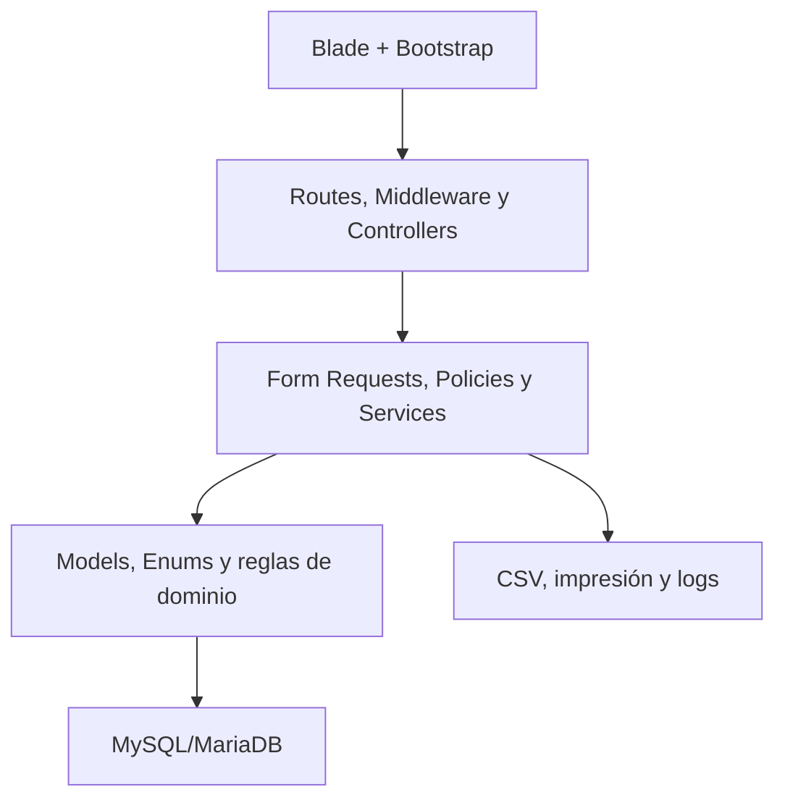
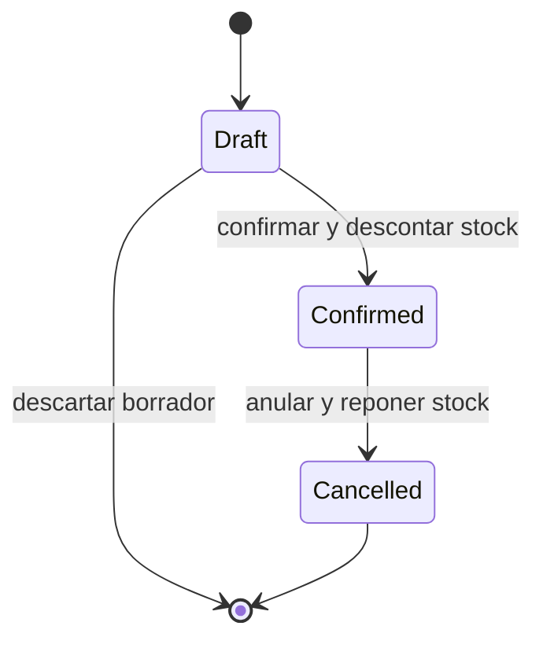

# Arquitectura de la solución

## Estilo

Monolito web modular construido con Laravel. Mantiene MVC para interacción HTTP y añade una capa de servicios para las reglas transaccionales. No se incorpora una API pública, microservicios ni patrón repositorio sin una necesidad demostrada.

## Responsabilidades por capa

| Capa | Responsabilidad | No debe hacer |
|---|---|---|
| Vistas | Presentación, accesibilidad y envío de formularios | Autorizar por sí sola o calcular totales definitivos |
| Controladores | Orquestar HTTP, invocar validación/Policy/Service y responder | Contener algoritmos de stock o ventas |
| Form Requests | Validación sintáctica y autorización de entrada | Modificar stock |
| Policies/Gates | Autorizar actor, acción y registro | Depender de que un botón esté oculto |
| Servicios | Ejecutar casos de uso y transacciones | Renderizar HTML |
| Modelos/Enums | Relaciones, casts, estados y consultas acotadas | Recibir directamente una solicitud HTTP |
| Base de datos | Integridad referencial, unicidad y persistencia | Sustituir validaciones de negocio legibles |

## Módulos

| Módulo | Responsabilidades | Dependencias |
|---|---|---|
| Identity | Sesiones, usuarios, roles, permisos, perfil | Auditoría |
| Catalog | Categorías, proveedores, clientes, productos | Identity, Auditoría |
| Inventory | Entradas, ajustes, stock, movimientos, kardex | Catalog, Identity, Auditoría |
| Sales | Borradores, confirmación, anulación, comprobante | Catalog, Inventory, Identity, Auditoría |
| Reporting | Panel, inventario, movimientos, ventas, CSV | Inventory, Sales |
| Operations | configuración, logs, respaldos y salud | Infraestructura |

## Componentes principales

- `PermissionService`: permisos efectivos y catálogo asignable.
- `StockService`: único punto autorizado para cambiar stock y crear movimientos.
- `StockEntryService`: confirma entradas completas.
- `InventoryAdjustmentService`: aplica ajustes autorizados.
- `SaleService`: crea borradores y confirma ventas.
- `SaleCancellationService`: anula y revierte stock de una venta.
- `SequenceService`: asigna números internos sin colisiones.
- `DashboardService`: agrega indicadores acotados.
- `InventoryReportService` y `SalesReportService`: consultas y exportaciones.
- `AuditService`: registra metadatos permitidos de acciones críticas.

## Modelo de estado

No existe transición de `confirmed` o `cancelled` a `draft`.

## Consistencia transaccional

Para entradas, ajustes, confirmación y anulación:

1. Validar permiso y datos básicos antes de abrir la transacción.
2. Abrir `DB::transaction`.
3. Bloquear el documento y los productos con `lockForUpdate`; cuando haya varios, usar orden ascendente por ID.
4. Revalidar estado, cantidades, stock y transición.
5. Crear detalles y movimientos.
6. Actualizar stock y estado del documento.
7. Registrar auditoría esencial.
8. Confirmar la transacción; cualquier excepción revierte todo.

## Numeración interna

La secuencia debe persistirse en una tabla o mecanismo con bloqueo. No debe calcularse con `MAX(number) + 1`, porque dos solicitudes concurrentes podrían repetir el número. El formato visible propuesto es `V-YYYY-NNNNNN`; el formato final puede cambiar sin modificar la identidad primaria.

## Errores y observabilidad

- Errores esperados: validación 422 o redirección con mensajes; autorización 403; registro inexistente 404; conflicto de estado 409 cuando aplique.
- Producción: página genérica, identificador de incidente y detalle solo en logs.
- Logs estructurados con canal, usuario cuando exista, correlación y entidad; sin credenciales ni cuerpos completos.

## Límites de integración

- Impresión: HTML/CSS y diálogo del navegador.
- Exportación: CSV generado por la aplicación.
- Respaldo: proceso operativo del servidor/base de datos, no comando arbitrario desde una ruta web.
- SRI, pagos, lectores y servicios externos: fuera del MVP.

