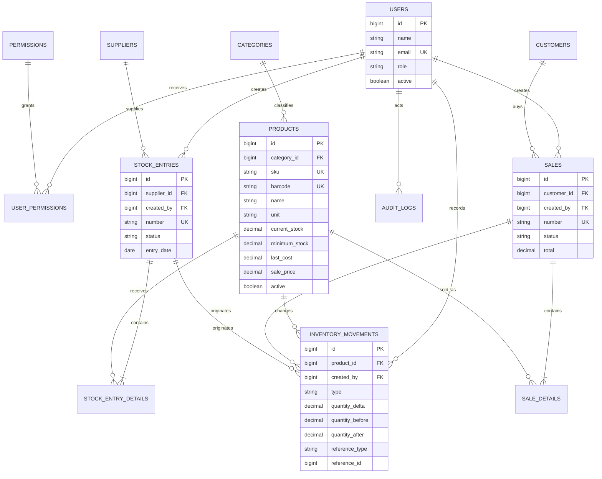

# Modelo entidad–relación

## Decisiones de modelado

- `products.current_stock` acelera operaciones y listados; `inventory_movements` es la bitácora que permite demostrar cómo se obtuvo el saldo.
- Ambos se actualizan en la misma transacción. Una verificación de consistencia debe detectar discrepancias.
- Detalles de entrada y venta conservan valores históricos; no dependen de que el nombre o precio actual del producto siga igual.
- Las referencias de `inventory_movements` son polimórficas (`reference_type`, `reference_id`) para enlazar entrada, venta o ajuste sin columnas nulas múltiples.
- `audit_logs` registra acciones de aplicación; no reemplaza los movimientos del inventario.
- Las claves primarias son técnicas. Números visibles de entradas y ventas poseen índices únicos independientes.

## Cardinalidades relevantes

1. Una categoría clasifica muchos productos; cada producto pertenece a una categoría.
2. Un proveedor puede originar muchas entradas; la entrada puede no tener proveedor cuando sea un ajuste inicial documentado.
3. Una entrada confirmada contiene uno o más detalles.
4. Una venta confirmada contiene uno o más detalles y puede asociarse a un cliente.
5. Cada detalle corresponde a un producto.
6. Todo producto puede acumular muchos movimientos, pero solo conserva un stock actual.
7. Un usuario puede generar operaciones y auditorías aunque después sea desactivado.

